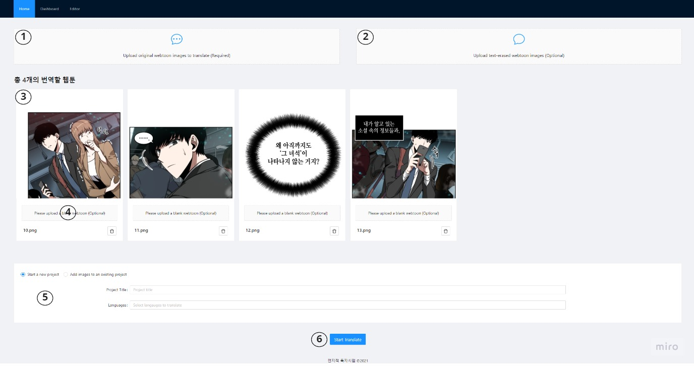
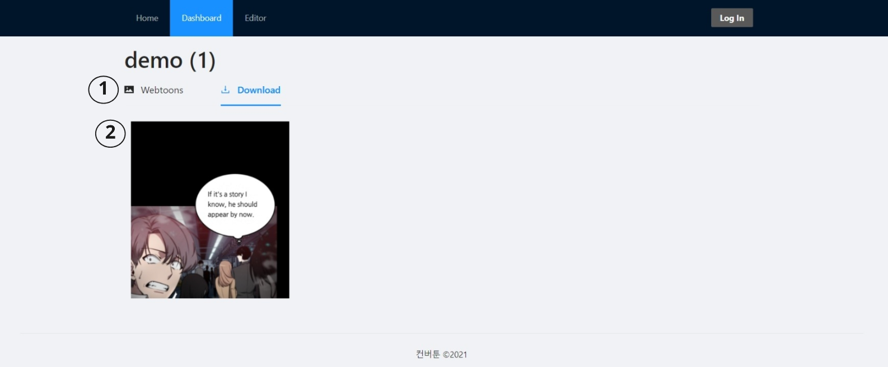
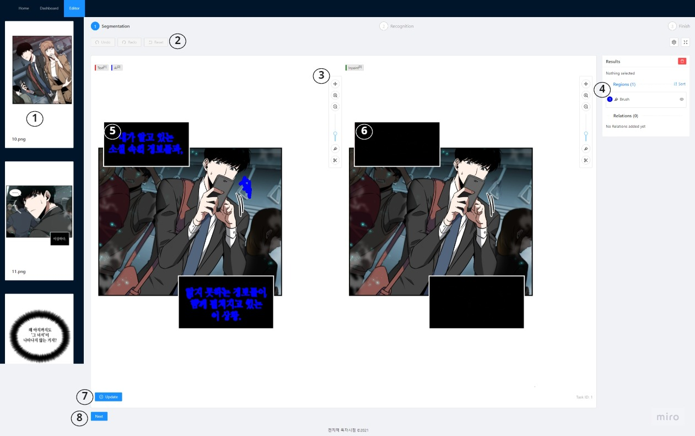
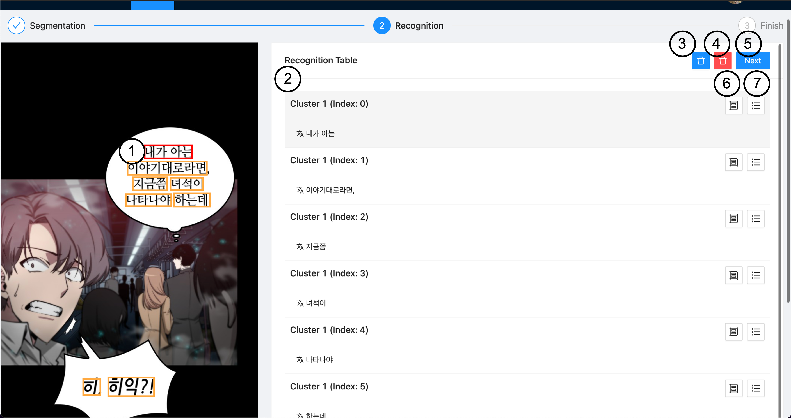
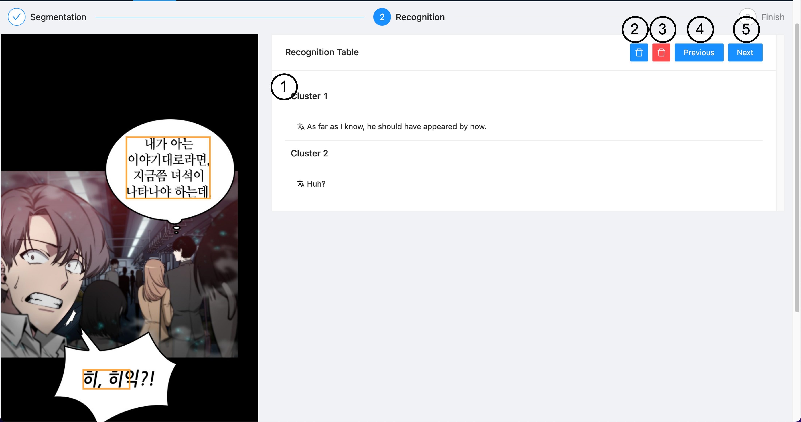
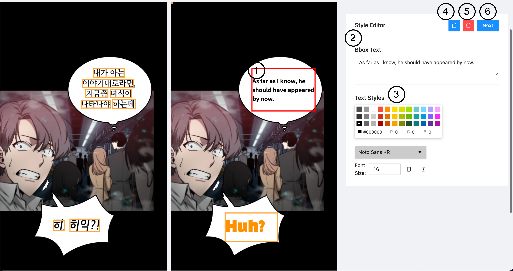

# 컨버툰 Frontend

## 개요
'전지적 번역시점' 팀의 프로젝트 **컨버툰** 의 프론트엔드 레포지토리입니다.
유저가 이미지를 업로드하여 번역을 할 수 있는 웹페이지를 제공합니다.

## 데모영상

[](https://youtu.be/bw9r-lrnhK8 "SWM Demo")

## 웹페이지 구조

### 업로드 페이지


1. 원본 이미지 업로드
2. 공백 이미지 업로드 (선택)
3. 업로드한 이미지 미리보기
4. 개별 이미지 공백 이미지 업로드 (선택)
5. 프로젝트 초기 설정
6. 프로젝트 시작

### 대시보드


1. 웹툰 리스트 / 유저 사전 / 다운로드 탭 변경
2. 미리보기 이미지 언어 설정
3. 번역할 웹툰 선택

### 다운로드


1. 현재 프로젝트 / 완료한 이미지 탭 전환
2. 작업 완료된 이미지 (클릭시 다운로드)

### Segmentation 페이지


1. 업로드한 웹툰 리스트
2. 마스크 되돌리기 / 초기화 기능
3. 이미지 확대/축소, 마스크 그리기/지우기 기능
4. 마스크 레이어 관리
5. 이미지 마스크 (파랑색)
6. 공백 이미지 미리보기
7. 수정한 마스크 업로드
8. 마스크 작업 완료

### Recognition Word 페이지


1. 인식된 단어 바운딩박스
2. 인식된 단어 목록
3. 선택한 단어 삭제
4. 전체 단어 삭제
5. 저장 후 문장 수정 단계로 이동
6. 선택한 단어 그룹 내 순서 변경
7. 선택한 단어 그룹 변경

### Recognition Sentence 페이지


1. 인식된 문장 목록
2. 선택한 문장 삭제
3. 전체 문장 삭제
4. 단어 수정 단계로 이동
5. 서식 수정 단계로 이동

### Recognition Style 페이지


1. 삽입된 번역된 문장 바운딩박스
2. 번역된 텍스트 텍스트 에디터
3. 번역된 텍스트 스타일 에디터
4. 선택한 텍스트 삭제
5. 전체 텍스트 삭제
6. 이미지 번역 완료 후 저장

## 레포지토리 구조

```text
src
|
---- adapters : axios등이 포함된 프론트엔드와 백엔드 통신 폴더입니다.
|
---- components : React 컴포넌트 폴더입니다.
|
---- contexts : Redux를 활용한 store 관련 폴더입니다.
|
---- pages : React 컴포넌트들이 모인 전체적인 페이지 폴더입니다.
|
---- styles : css등 스타일 관련 폴더입니다.
```

