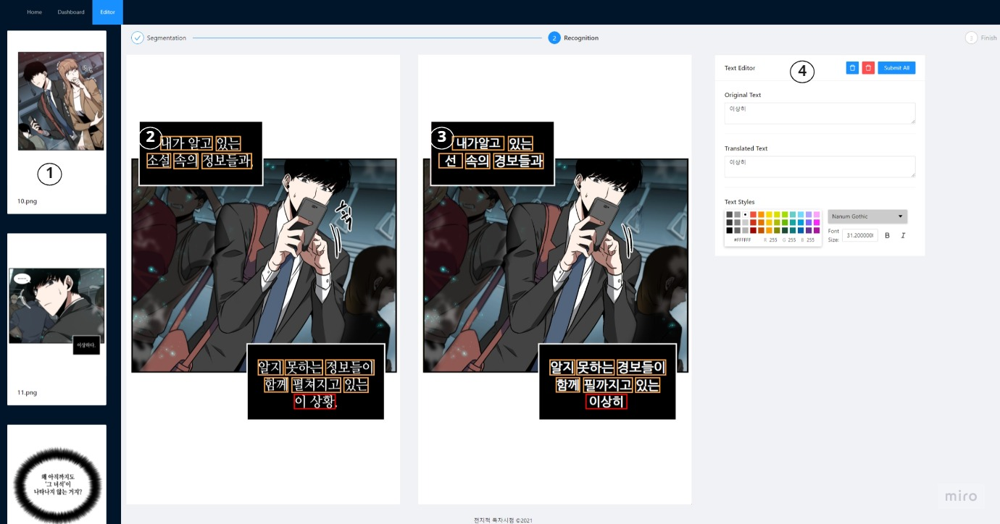

# Frontend

## Demo Video

## Page Layout

### Upload Page

1. 원본 이미지 업로드
2. 공백 이미지 업로드 (선택)
3. 업로드한 이미지 미리보기
4. 개별 이미지 공백 이미지 업로드 (선택)
5. 프로젝트 초기 설정
6. 프로젝트 시작

### Dashboard Page

1. 웹툰 리스트 / 유저 사전 / 다운로드 탭 변경
2. 미리보기 이미지 언어 설정
3. 번역할 웹툰 선택

### Segmentation Page

1. 업로드한 웹툰 리스트
2. 마스크 되돌리기 / 초기화 기능
3. 이미지 확대/축소, 마스크 그리기/지우기 기능
4. 마스크 레이어 관리
5. 이미지 마스크 (파랑색)
6. 공백 이미지 미리보기
7. 수정한 마스크 업로드
8. 마스크 작업 완료

### Recognition Page

1. 업로드한 웹툰 리스트
2. 인식된 텍스트 바운딩박스
3. 삽입된 텍스트 바운딩박스
4. 텍스트 에디터