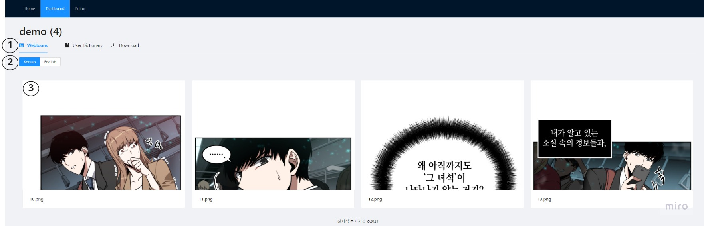

# 컨버툰 Frontend

## 개요
'전지적 번역시점' 팀의 프로젝트 **컨버툰** 의 프론트엔드 레포지토리입니다.
유저가 이미지를 업로드하여 번역을 할 수 있는 웹페이지를 제공합니다.

## 데모영상

[](https://youtu.be/bw9r-lrnhK8 "SWM Demo")

## 웹페이지 구조

### 업로드 페이지


1. 원본 이미지 업로드
2. 공백 이미지 업로드 (선택)
3. 업로드한 이미지 미리보기
4. 개별 이미지 공백 이미지 업로드 (선택)
5. 프로젝트 초기 설정
6. 프로젝트 시작

### 대시보드


1. 웹툰 리스트 / 유저 사전 / 다운로드 탭 변경
2. 미리보기 이미지 언어 설정
3. 번역할 웹툰 선택

### Segmentation 페이지


1. 업로드한 웹툰 리스트
2. 마스크 되돌리기 / 초기화 기능
3. 이미지 확대/축소, 마스크 그리기/지우기 기능
4. 마스크 레이어 관리
5. 이미지 마스크 (파랑색)
6. 공백 이미지 미리보기
7. 수정한 마스크 업로드
8. 마스크 작업 완료

### Recognition 페이지


1. 업로드한 웹툰 리스트
2. 인식된 텍스트 바운딩박스
3. 삽입된 텍스트 바운딩박스
4. 텍스트 에디터


## 레포지토리 구조

```text
src
|
---- adapters : axios등이 포함된 프론트엔드와 백엔드 통신 폴더입니다.
|
---- components : React 컴포넌트 폴더입니다.
|
---- contexts : Redux를 활용한 store 관련 폴더입니다.
|
---- pages : React 컴포넌트들이 모인 전체적인 페이지 폴더입니다.
|
---- styles : css등 스타일 관련 폴더입니다.
```

